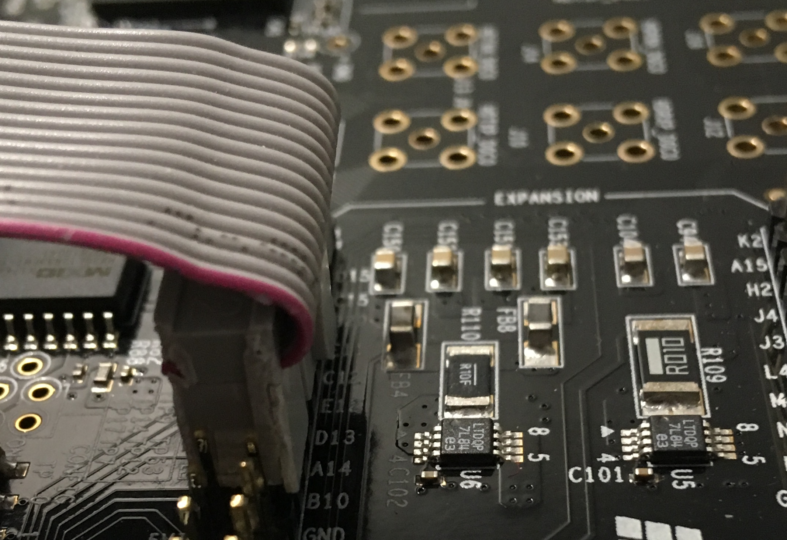
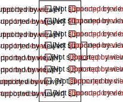
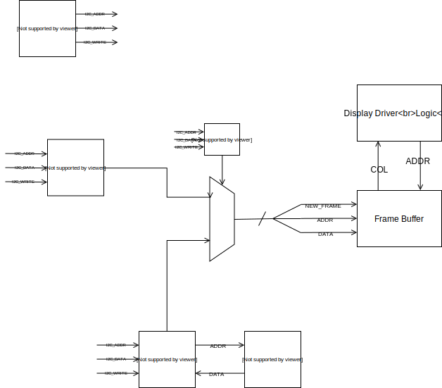

## What Is This
A simple way to drive LED Matrix displays without consuming all your Arduino CPU cycles.
### Operation
The Arduino can operate the display in two modes. Text mode and graphical mode. In text mode, the Arduino sends the FPGA characters to render. In graphical mode, the Arduino can address blocks of the display followed by a stream of 24-bit pixel values to display.
### Interface
The Arduino can communicate with the FPGA both over SPI and I2C.
# Documentation
Full on Documentation soon to be generated with Sphinx.
# Dependencies
You'll need the following. Most of the development was done in MacOs, but has been tested in Ubuntu 16.04 and should work in most Linux distributions. Some of these tools are available in local package managers such as brew and apt.
 - [icestorm suite](http://www.clifford.at/icestorm/)
 - [prjtrellis](https://github.com/SymbiFlow/prjtrellis)
 - [yosys](http://www.clifford.at/yosys/download.html)
 - [openocd](http://openocd.org/getting-openocd/)
 - [nextpnr](https://github.com/YosysHQ/nextpnr)
#  Getting Started 
## Quick Workflow Overview
``make lint`` in /rtl will cause verilator to lint all verilog files. ICE40 and ECP5 specific modules and logics are excluded from linting via `` `ifndef verilator``
The verilog can currently be automatically synthesized for either the ice40 architecture, or the ecp5 architecture. I broke my ice40 HX8K, so only the ecp5 configuration is currently the only architecture being actively supported.
## Pinout
The pinouts for the respective architecture can be found in the rtl/ice40 and rtl/ecp folders respectively. The pinouts were chosen with the [iCE-40-Hx8k Breakout Board](https://www.latticesemi.com/Products/DevelopmentBoardsAndKits/iCE40HX8KBreakoutBoard.aspx) and the [ECP5 Evaluation Board](http://www.latticesemi.com/ecp5-evaluation) evaluation board in mind.
### ECP5 Evaluation Board
Slicing off the tabs and part of the casing of the 16 pin ribbon cable terminal connector allows the connector to be placed snugly on the Versa header of the PCB as shown below.

This is the corresponding pinout.

## References
 - [RaysLogic](http://www.rayslogic.com/propeller/programming/AdafruitRGB/AdafruitRGB.htm)
  - [Useful DataSheet for driver chips](http://www.rayslogic.com/propeller/programming/AdafruitRGB/MBI5026.pdf)
## Architecture
The current architecture is somewhat as presented below.

# Tasks
## Display Logic
 - [x] Display basic 3-bit color.
 - [ ] Confirm logic is functional with verilator
 - [ ] Display streak free colors on the FPGA
 - [ ] Display entire image on FPGA
 - [ ] Rewrite display logic to be addressable
 - [ ] Drive with single frame buffer
 - [ ] Write LibPNG wrapper for display logic

## Frame Buffer
